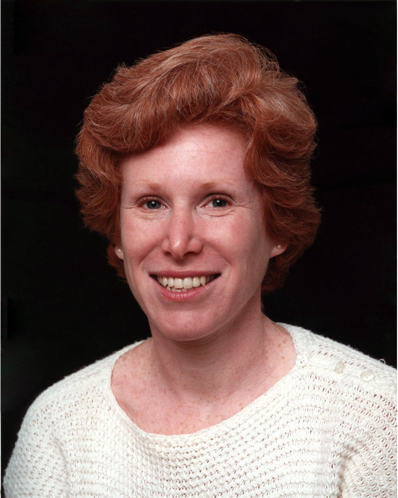

##Making Adele proud, every week.

####Adele Goldberg is best known for her work with Alan Kay and others in developing the object-oriented computing language Smalltalk in the 1970s and 1980s. Smalltalk was one of the most influential programming languages -- virtually all object-oriented languages that came after were influenced by it. The Smalltalk language and environment were tremendously influential in the history of the Graphical User Interface (GUI) and the What You See Is What You Get (WYSIWYG) user interface.
